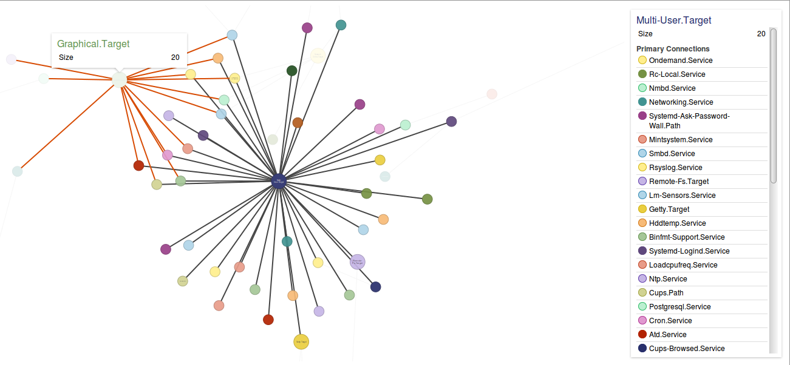

# Systemd Visualization

## Requirements

* Python 2.7
* d3plus.v1.9.8

# Usage

Generate dot file from a running linux system by:

    systemd-analyze dot > <filename>

Run the Python script:

    python visualizeDot_d3plus.py <generated_dot_file>

#Screenshot

